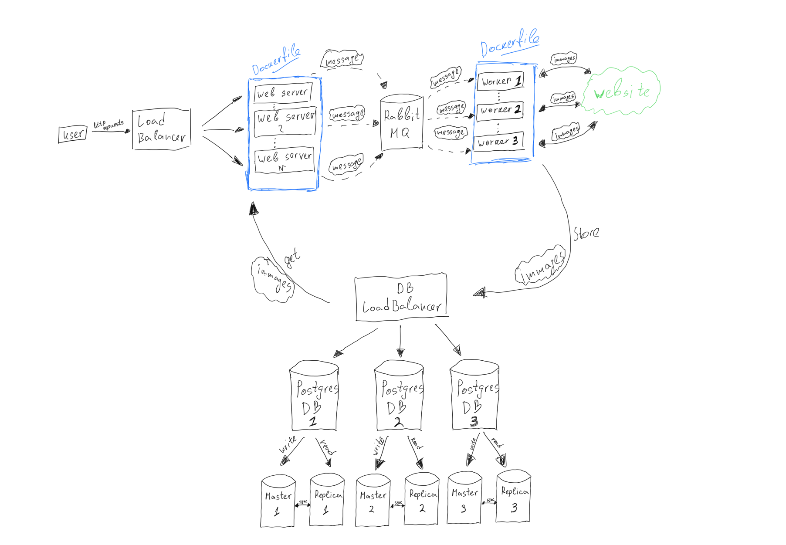

# POC Webcrawler to Scrape images for given url

## Installation
1. Install Python 3.11
2. Create a virtual environment
3. Install requirements.txt
4. Run main.py
5. Adjust .env to suit your needs or leave it default
6. Run tests with pytest: ```pytest app/tests```
7. Run worker process with: ```dramatiq app.tasks``` (make sure you have RabbitMQ running)

## Usage
### FastAPI server is running on http://localhost:8000
### Swagger UI is running on http://localhost:8000/docs

For local development and testing, you can use the following command to run the full stack of the service:
```bash
docker-compose build && docker-compose up
````

### Endpoints
#### 1) POST /screenshots
##### Request body
```json
{
  "start_url": "https://edited.com",
  "number_of_links_to_follow": 10
}
```
##### Response body
```json
{
  "unique_id": "3c0d57ce-b0ec-4c7d-91e4-0033936eac87"
}
```

#### 2) GET /screenshots/{unique_id} (unique id is returned from the POST request)
##### Response:
A zip file with screenshots

## Technologies used
### FastAPI
- FastAPI is used as a web framework
- It is a modern, fast (high-performance), web framework for building APIs with Python 3.6+ based on standard Python type hints.
- It is one of the fastest Python frameworks available, on par with NodeJS and Go (thanks to Starlette and Pydantic).
- It has built-in support for GraphQL and WebSockets, and includes a development server.

### Dramatiq
- Dramatiq is a distributed task processing library for Python with a focus on simplicity, reliability and performance.
- Dramatiq is designed to be friendly to both application developers and infrastructure operators, and is built for multithreaded applications that expect a high rate of task throughput.

### RabbitMQ
- RabbitMQ is the most widely deployed open source message broker.
- With tens of thousands of users, RabbitMQ is one of the most popular open source message brokers.
- From T-Mobile to Runtastic, RabbitMQ is used worldwide at small startups and large enterprises.
- RabbitMQ is lightweight and easy to deploy on premises and in the cloud. It supports multiple messaging protocols. RabbitMQ can be deployed in distributed and federated configurations to meet high-scale, high-availability requirements.

### PostgreSQL
- PostgreSQL is a powerful, open source object-relational database system with over 30 years of active development that has earned it a strong reputation for reliability, feature robustness, and performance.
- PostgreSQL runs on all major operating systems, has been ACID-compliant since 2001, and has powerful add-ons such as the popular PostGIS geospatial database extender.
- It is no surprise that PostgreSQL has become the open source relational database of choice for many people and organisations.

## Design
FastAPI serves the endpoints and the request is sent to the worker process via RabbitMQ. The worker process is responsible for the actual scraping and saving the screenshots' metadata to the database and the images locally. 


### IMPORTANT NOTE
This design is not fully covered in the code, as scaling and distribution is not part of the code. The code is designed to be able to scale and distribute the work, but additional improvements are required.

## Deployment
The service could be deployed using the provided Docker image in the appropriate environment respectively in ./deployment/development or ./deployment/production. Alongside the docker images, we have .env files to provide the necessary configurations. The service is configured to use the following environment variables:
- POSTGRES_USER
- POSTGRES_PASSWORD
- POSTGRES_DB
- POSTGRES_HOST
- POSTGRES_PORT
- POSTGRES_SCHEMA
- RABBITMQ_HOST
- RABBITMQ_PORT
- RABBITMQ_USER
- RABBITMQ_PASSWORD

## Improvements to be made
- Add authentication
- Add more tests
- Add more logging
- Add more error handling
- Add more validations
- Add more documentation
- Implement pagination for the GET endpoint and split logic for the zip file creation in case of huge number of images
- Replace local file system with a cloud storage service like AWS S3 for the images to support horizontal scaling
- Create helm charts for Kubernetes deployment

## Scaling
- The service could be scaled horizontally by adding more instances of the worker process and the web server.
- The service could be scaled vertically by increasing the resources of the worker process and the web server.
- The service could be scaled by adding more RabbitMQ instances and configuring them to work in a cluster.
- The service could be scaled by adding more PostgreSQL instances and configuring them to work in a cluster.
- The service could be scaled by adding a load balancer in front of the web server.
- The service could be scaled by adding a load balancer in front of the RabbitMQ instances.
- The service could be scaled by adding a load balancer in front of the PostgreSQL instances.
- The service could be scaled by adding a cache layer in front of the PostgreSQL instances.